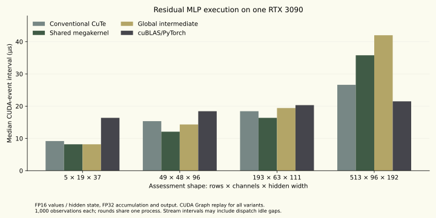

# Recorded GPU results

October 5, 2026. One RTX 3090; FP16 input/weights/hidden and FP32 accumulation/bias/output. Device-resident input/output. CUDA Graph replay for every listed variant.

| Assessment shape (rows × channels × hidden) | Conventional CuTe | Shared megakernel | Global intermediate | cuBLAS/PyTorch |
|---|---:|---:|---:|---:|
| 5 × 19 × 37 | 9.18 µs | 8.19 µs | 8.19 µs | 16.38 µs |
| 49 × 48 × 96 | 15.36 µs | 12.10 µs | 14.34 µs | 18.43 µs |
| 193 × 63 × 111 | 18.43 µs | 16.38 µs | 19.42 µs | 20.32 µs |
| 513 × 96 × 192 | 26.62 µs | 35.78 µs | 41.98 µs | 21.50 µs |

The values are median CUDA-event stream intervals. They can include dispatch idle gaps. Each variant has 1,000 observations across five rounds in one process. These are preliminary observations on original small workloads, not a universal speedup or a claim about wearable/whole-LLM latency.

The shared-memory path is useful on smaller graphs. The largest assessment shape favors cuBLAS; the persistent path loses. The global-intermediate control preserves the computation and owner schedule while changing intermediate storage; resource allocation effects are part of that comparison.

Positive/negative C++ pass checks and both end-to-end scheduling routes passed numerical comparison. Memory, race and synchronization checks reported no errors on the validated cases. Source hashes and aggregate data are in [the recorded result](../results/gpu-kernel-results.json). Raw samples and generated binaries remain local and can be regenerated with the documented commands.

